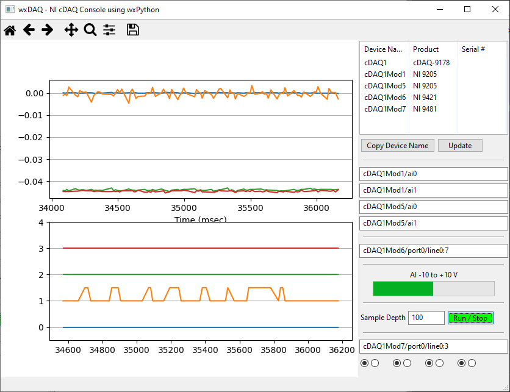

# wxDAQ
NI cDAQ Console using wxPython

Initially, I made `wxDAQ.py` just for fun, However, I later improved it to handle
situations where users make mistakes or encounter hardware problems.
I'm amazed by the high productivity that Python offer,
even though it might not be the best choice for core programming tasks.

Application Architecture:
 - GUI Part: The GUI layer is developed using the `wxPython` library, providing a user interface.
 - Data Acquisition Part: The `nidaqmx` library is utilized to communicate with and control the NI DAQ devices.
 - Data Visualization Part: The `matplotlib` library is integrated into the GUI for real-time visualization of acquired data.
 - Control Logic Part: This layer manages user interactions, data acquisition threads, and data visualization updates.

Thread Management:
 - Analog Data Collection: A separate thread collects analog data from specified channels using the `nidaqmx` library.
 - Digital Data Collection: Another thread collects digital data from the specified channel using the `nidaqmx` library.
